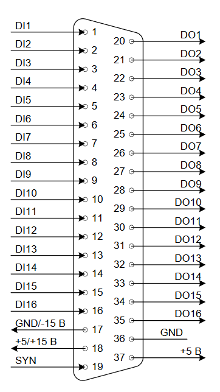

*https://www.cyberforum.ru/cpp-cli/thread1563955.html // смотреть свои файлы*

# VolgaEnergoPromVersionWithSQLiteDB
## Проект ВолгаЭнергоПром, стенд АНС-500 для проведения испытаний. Реализована на языке c++/cli на winAPI в "тупую" методом "научного тыка".

Используемый прибор: L-Card E14-140M (https://www.lcard.ru/products/external/e-140m)

### Цифровая часть.

На плате цифровые выходы DO1-DO6 отвечают за нагрузочные сопротивления.
На вход DI1 подаётся сигнал защиты по превышению тока. Если ток выше 550А, тогда прекращаются измерения. 1 на входе - защита работает, предохранитель ещё не оборвался, 0 - сработала защита, предохранитель сдох.
Выход DO9 вырабатывает синхроимпульс, длительность которого составляет 100 мксек, режим работы "0" и "1". Для программы STT.
Цифровой выход DO10 определяет режим нагрузки: полная или половина нагрузки. Если DO10 == 1, тогда полная нагрузка, иначе половина нагрузки.

### Аналоговая часть

X1 - измерения тока
X2 - измерения напряжения
X3 - определения наличия напряжения. Если напряжение > 5-6 В, начинается процесс нагрузки и измерений. Актуально только для режима MIG/MAG.

## Рабочие программы
### MMA
При запуске программы (кнопка Старт) изменяются состояния цифровых выходов (DO1-DO6) от 0 до 63 длительность ступени 300 мсек. Измеряются ток и напряжение, значения заносятся в файл/дублируются в базу данных в таблицу MMA. Напряжения и токи округляются с точностью 0,1 А; 0,1 В. Напряжения и токи измеряются спустя 300 мсек. Это необходимо для установления значений токов и напряжений. После достижения состояния «63» происходит обратная «разгрузка» до «0» плавно, задержка на каждой ступени составляет 100 мсек.
Перед началом измерений выбирается состояние DO10 с помощью чек-бокса.

### MIG/MAG
Запуск программы происходит после выполнения двух условий: нажата кнопка старт и на входе X3 есть напряжение > 5-6 В, после чего начинается нагрузка, напряжение на X3 больше не наблюдается. Измеряются ток и напряжение, значения заносятся в файл/дублируются в базу данных в таблицу MIGMAG. Напряжения и токи округляются с точностью 0,1 А; 0,1 В. Напряжения и токи измеряются спустя 300 мсек. Это необходимо для установления значений токов и напряжений. После достижения состояния «63» происходит обратная «разгрузка» до «0» плавно, задержка на каждой ступени составляет 100 мсек.
Перед началом измерений выбирается состояние DO10 с помощью чек-бокса, а также выбирается состояние DO7 - автоматический или ручной режим работы. При автоматическом режиме всё происходит "автоматом", пользователь только наблюдает. При ручном режиме работы - включается лампочка в форме и появляется надпись: "Удерживайте нажатой кнопку горелки до окончания измерений". По завершению процесса разгрузки всё приходит в исходное состояние. 

Особенности: при преодолении тока более 500 А не имеет смысл проводить испытания дальше, можно включать разгрузку.

### STT
Измерения не производятся, только работает защита по DI1, только наблюдения на экране осциллографа. Программа состоит из циклического изменения сопротивления нагрузки. Запуск - по нажатию кнопки "Старт", остановка - "Стоп". Цикл измерений выглядит следующим образом: Синхроимпульс(DO9->1)->200 мксек->Синхроимпульс(DO9->0)->Выдержка(в мксек)->Rt1->Rt2->Rt3->Rt4->Rt5->Синхроипульс(DO9->1)...
Rt1...Rt5 - Сопротивление нагрузки R работает время t.
Перед запуском устанавливаются значения R - от 0 до 63 бегунком. Длительность включения выбранного сопротивления - t1...t5. устанавливается с помощью бегунков от 0 до 500 мсек с шагом 25 мсек.
Можно изменять величину выдержки с шагом 20 мксек до 200 мксек.

### TIG
Алгоритм работы TIG ещё прорабатывается. Но общие шаги следующие:
Выбирается режим нагрузки и вводится в текстовое поле значение тока. Автоматически происходит перерасчёт напряжения по формуле: Uуст = (0.04 Iуст) + 15
При нажатии кнопки "Старт" вылетает сообщение-предупреждение: "проверьте осциллятор!". После выбора ответа на сообщение происходит один из двух вариантов: 
1) продолжить испытания;
2) отменить испытания.
В первом варианте, вся цифровая линия прибора переходит резко в 1 (63 сопротивление), держится 500 мсек, затем резко происходит сброс сопротивления до DO1-DO2 с одновременным включением DO7. Затем происходит "традиционный" алгоритм набора сопротивления до 63, после чего происходит разгрузка до 0. 

Особенности: при разнице напряжения X2 (входного) / 2 < напряжения U уст., полученного по формуле, не имеет необходимости проводить испытания дальше, можно включать разгрузку.

### Срабатывание защиты
Если вдруг срабатывает защита, тогда нагрузка на выходной линии переходит в 0. Перед каждым запуском программы проведения испытаний проверяется срабатывание защиты. 

### Картинки и руководство
Полное руководство пользователя и картинки с подробным описанием что и как надо делать будут приведены позднее. 
